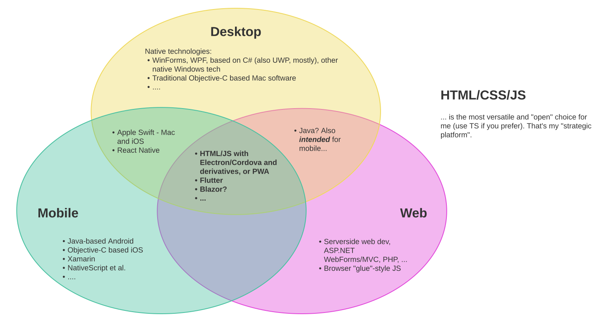

title: Desktop Apps with React
subtitle:
class: animation-fade
layout: true

<!-- This slide will serve as the base layout for all your slides -->

.bottom-bar[
{{title}}
]

---

class: impact

# {{title}}

## {{subtitle}}

.title-oli[
Oliver Sturm &bull; @olivers[@fosstodon.org] &bull; oliver@oliversturm.com
]

.title-logo[

]

---

## Oliver Sturm

- Training Director at DevExpress
- Consultant, trainer, author, software architect and developer for 30 years

- Contact: oliver@oliversturm.com

---

## Agenda

- _forgot to fill this out_

---

## Choice of Platform

.svg-light-100[]

---

## React? What else?

- npm-stat.com reports 426 million `react` package downloads between 2020-02-15 and 2021-02-15
  - for comparison 95 million for `@angular/core`, 92 million for `vue`, 1.7 billion for `lodash`
- w3techs.com agrees that React leads, but their results are more complex and distinguish various categories of websites
- In any case, which is the best desktop tech based on HTML/JS?
- Answers are subjective!
- The path to the desktop is similar for various HTML/JS based solutions.

---

## What's in a cross-platform desktop app?

- Visual appearance would have once been a main point, but is not very important today
  - Visual desktop components may be more complex than those for the web, but the web has influenced the desktop for years already
- Code that interfaces correctly with various OSs would have once been difficult to write, but that's no longer true
- Integration with OS-specific features
  - But keep in mind that there are many standardized web APIs today: camera, notifications, badges, file system access, Bluetooth, USB, NFC, etc - also check out https://web.dev/fugu-status/ (Chromium Web Capabilities)
- Packaging, setup, updates

---

class: impact

# Demo

## A first simple Electron app with React

---

## Split world inside Electron

- Renderer process in the embedded browser
- "Main" process: Node
- Side note: Electron.NET uses .NET Core instead of Node - potentially interesting alternatives for C# fans
- (Almost) Direct communication between the two processes turned out to be quite dangerous
- Careful bridging is required

---

## APIs for OS features

- Global `app` object: standard folders, file icons, recent documents, protocol client registration, Windows jump lists, "user tasks", Mac "activities" (handoff support), Mac dock integration, Badges (Linux and Mac), start at login (Mac, Windows)... and quite a few more
- `BrowserWindow` (per window) functionality: progress bar, represented file (Mac), overlay icon (Windows), shadow, opacity, menus, kiosk support, scrolling and other window features, workspaces... and many others
- Screen (multi display support), System Preferences (colors, native appearance), Touchbar, Tray, Power Monitoring, Global Shortcuts, in-app purchases, ...
- It's a long list!

---

class: impact

# Demo

## Context Bridging and OS integration

---

## Sources

- This presentation:  https://oliversturm.github.io/desktop-apps-with-react/
- Repository with sample code:  https://github.com/oliversturm/desktop-apps-with-react
- PDF download:  https://oliversturm.github.io/desktop-apps-with-react/slides.pdf

---

class: impact

# Thank You

Please feel free to contact me about the content anytime.

.title-oli[
Oliver Sturm &bull; @olivers[@fosstodon.org] &bull; oliver@oliversturm.com
]

.title-logo[

]
